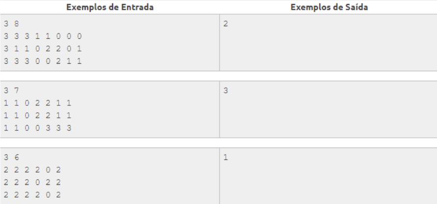
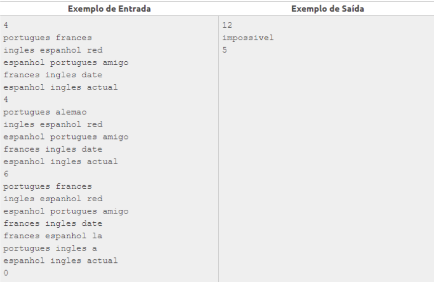
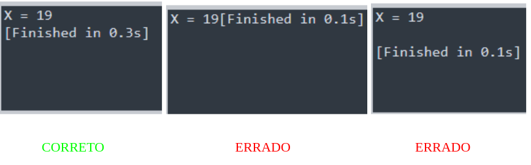
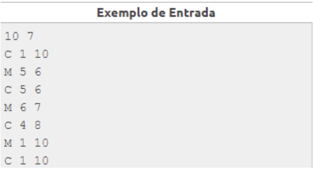
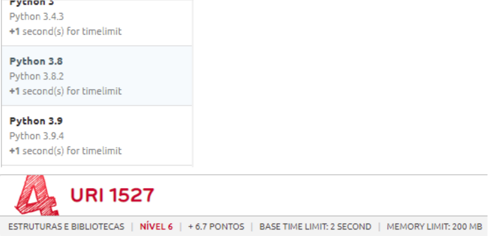

# Boas vindas ao repositório tutorial para a plataforma BeeCrowd!

Este repositório contém a solução dos exercícios tutoriais de nivel iniciante da plataforma BeeCrowd.

O objetivo é exemplificar como a plataforma trata a entrada e saída de dados.

## Plataforma BeeCrowd
[BeeCrowd](https://www.beecrowd.com.br/)

## O que é?

Plataforma que disponibiliza desafios de programação, com um Juiz(Avaliador) que lhe responde se a sua solução esta correta.
Além de permitir a realização de torneiros e maratonas.

Nela você encontrará diversos problemas com vários níveis de dificuldade e dos amis diversos assuntos.

## Por que experimentar?

Muitas empresas utilizam, em suas entrevistas, desafios de **resolução de problemas** de programação, como Facebook, Amazon, Apple, Netflix, Google e a **FORD**. 
Nesse sentido, queremos lhe apresentar uma das ferramentas mais utilizadas. E iremos aqui tornar a experiência inicial mais fácil para você.

## Problema

É comum dificuldades surgirem nos primeiros usos de qualquer plataforma, até avançar na curva de aprendizagem da mesma.
Este projeto fornece exemplo de soluções dos desafios iniciais, e que com estes exemplos, esperamos que você entenda como funciona o **BeeCrowd**.

## Solução

1. Apresentação da plataforma
2. Entrada/Saída
3. Respostas do juiz
4. Fazer um exemplo com cada entrada possível da plataforma.

## Próximos passos

Treinar, treinar e treinar.

## Entradas e Saídas

Existem alguns tipos de entradas e saídas nos problemas do BeeCrowd, as mais comuns são:

## Entradas

- ### Casos de testes individuais:
  - Cada caso de teste é armazenado em um único **arquivo**.
    
    Três casos de testes em arquivos independentes e suas saídas esperadas.

- ### Múltiplos casos de testes: (Ex.: Desafio 1010)
  - Em um **arquivo** , pode haver mais de um caso de teste.
    Os múltiplos casos de teste terminam quando é fornecido o valor 0.
    
    Três casos de teste em um único arquivo, com uma única saída.

## Tratando entradas/saídas

Há diferentes formas de tratar as entradas/saídas em múltiplos casos de teste, sendo elas:

- O **número** de casos de teste pode ser fornecido na **primeira linha da entrada** ;
- Os casos de teste podem ser **terminados** com valores especiais, tais como **0** ou **\*** , não limitado a eles;
- Também há a possibilidade dos casos de teste terminarem em **EOF** (sigla para **end-of-file** ).

Exemplo de leitura em um caso de teste que termina em **EOF** :

```
_while True:_
  _try:_
    _...lógica..._
  _except EOFError:_
    _break_
```

## Saídas

As saídas geralmente devem estar acompanhadas de **uma** quebra de linha, exemplo:



Entretanto, no enunciado do problema estará especificado a forma correta, caso contrário, tenha como _default_ este exemplo.

## Arquivos de entrada e saída

Apesar de lermos pela entrada padrão
ex: 
```
  a = input()
  b = int(input())
  c = float(input())
```
por trás, na verdade, nós estaremos lendo e escrevendo em **arquivos** , por isso, também devemos ter um cuidado no trato dessas informações, exemplos:

No **Python** , quando lemos com **_input()_**, o mesmo fará a leitura da linha inteira. Dito isso, em um caso de teste de exemplo como:



No primeiro _input()_ será lido uma **string** com **&quot;10 7&quot;**, no segundo **&quot;C 1 10&quot;** e assim sucessivamente. Visto isso, é nítido que é necessário um tratamento desses dados. _(conversões, atribuições, etc…)._

## Como o juiz avalia

O seu código-fonte será enviado e o sistema executará todos os casos de teste disponíveis para aquele problema e sua saída deve ser **IGUAL** a saída esperada.

Além disso, há algumas **restrições** que devem ser levadas em consideração, como o **tempo de execução e o limite de memória usado.**

No exemplo abaixo o algoritmo deve passar nos casos de teste com um tempo de execução máximo de **2 segundos** e uso máximo de memória em **200MB.**

Cada linguagem tem sua particularidade, então algumas possuem um tempo limite diferente, no python, por exemplo, é de **1 segundo a mais** , ou seja, no problema abaixo o tempo limite para python seria de **3 segundos**.



## Leitura auxiliar:

📌 [FAQS JUDGE](https://www.beecrowd.com.br/judge/pt/faqs/about/judge)

📌 [FAQS PROBLEMS](https://www.beecrowd.com.br/judge/pt/faqs/about/problems)

📌 [FAQS EXAMPLES](https://www.beecrowd.com.br/judge/pt/faqs/about/examples)
